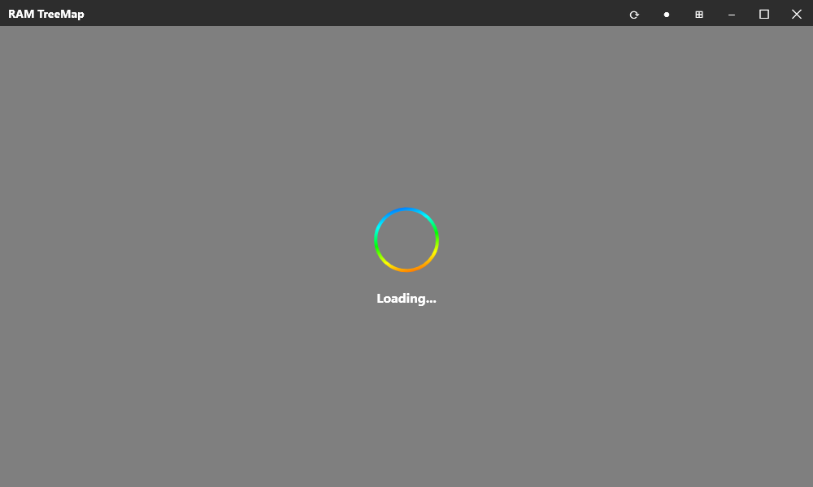
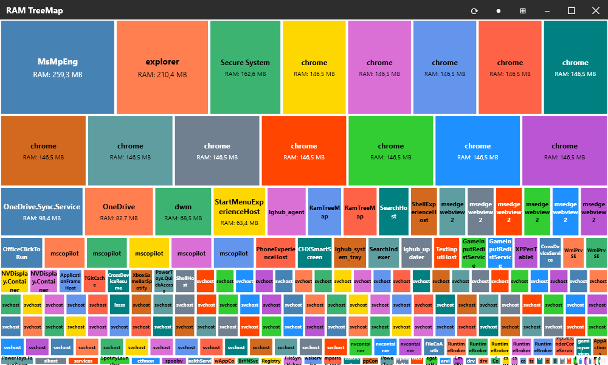
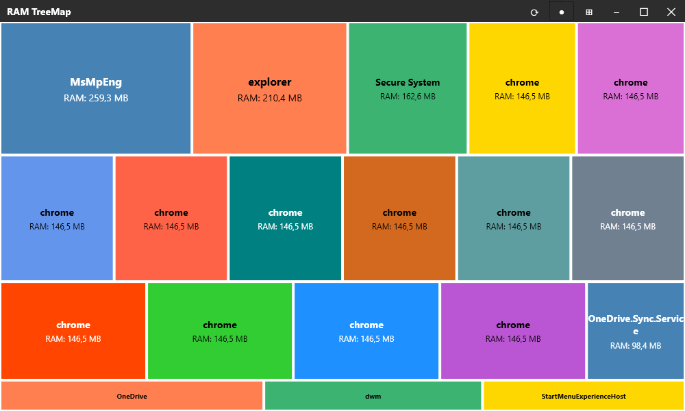
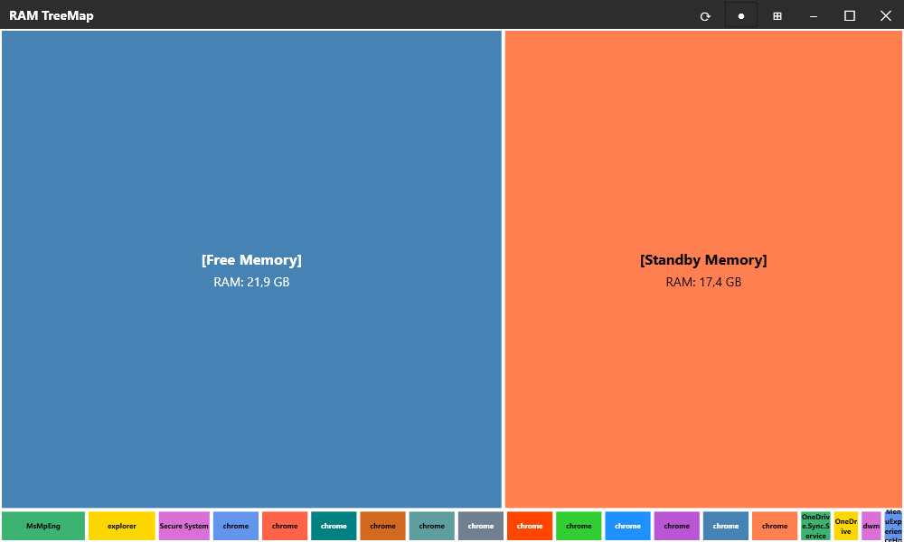
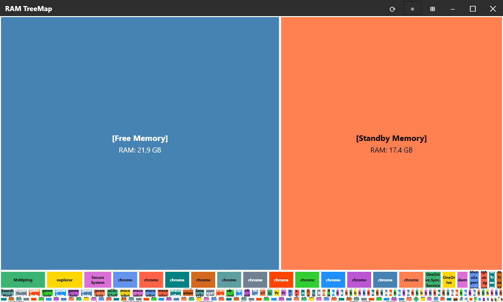

# RamTreeMap

`RamTreeMap` shows the current RAM usage on a windows PC as a treemap on process level.

## ✨ Features

The user can select to
- enable/disable the view of free/standby RAM
- enable/disable the view of processes using only a little amount of RAM (<1% of total available RAM)

## 🚀 Installation

Download the latest release ZIP from github CI builds: https://github.com/Xargas/RamTreeMap/releases

## 🖼️ Screenshots

